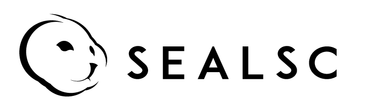

# 

# SealSC: the Seal Smart Contract Cloud 

> It is smart contract platform for one-key compilation & one-key depolyment. 
> It provides customized implementations of contracts which you can deploy as-is your needs. 
> You can build decentralized systems cross-chains with it.

More details can be found in [seal-specs](https://github.com/SealSC/https://github.com/SealSC/seal-specs.git).

# Introduction

SealSC is a ont-key platform witch serives all blockchain developers. Our aim is To make the contracts be written and used easily and safely.  
There are too may blockchains currently. Developers are hard to choose one of the to build themselves decentralized applications(DAPP). 

* Developers can deploys a contract easily, even a beginner. 

* Developers can customize their contract by using SealSC.

* Developers can build theire DAPPs across-chains.

# Resources

## Platform

Platforms supported by SealSC:

|Platform |smart contract | Support|
|---------|---------------|--------|
|Ethereum |Solidity       |  YES   |
|EOS      |WASM           |  YES   |
|Ontology |NEO            |  YES   |
|Tron     |Solidity       |  YES   |

## Smart contracs

#### [smart-contracts-ethereum](https://github.com/SealSC/smart-contracts-ethereum)

smart-contracts-ethereum is a Ethereum contract repo that contains all of contracts wrote by Ethereum Solidity.

#### [smart-contracts-eos](https://github.com/SealSC/smart-contracts-eos)

smart-contracts-eos is  EOS contract repo that contains all of contracts wrote by EOS WASM.

#### [smart-contracts-ontology](https://github.com/SealSC/smart-contracts-ontology)

smart-contracts-ontology is Ontology contract repo that contains all of contracts wrote by NEO contract.

#### [smart-contracts-tron](https://github.com/SealSC/smart-contracts-tron)

smart-contracts-tron is Tron contract reposthat contains all of contracts wrote by Trx Solidity.

# License

SealSC is released under the MIT License.
